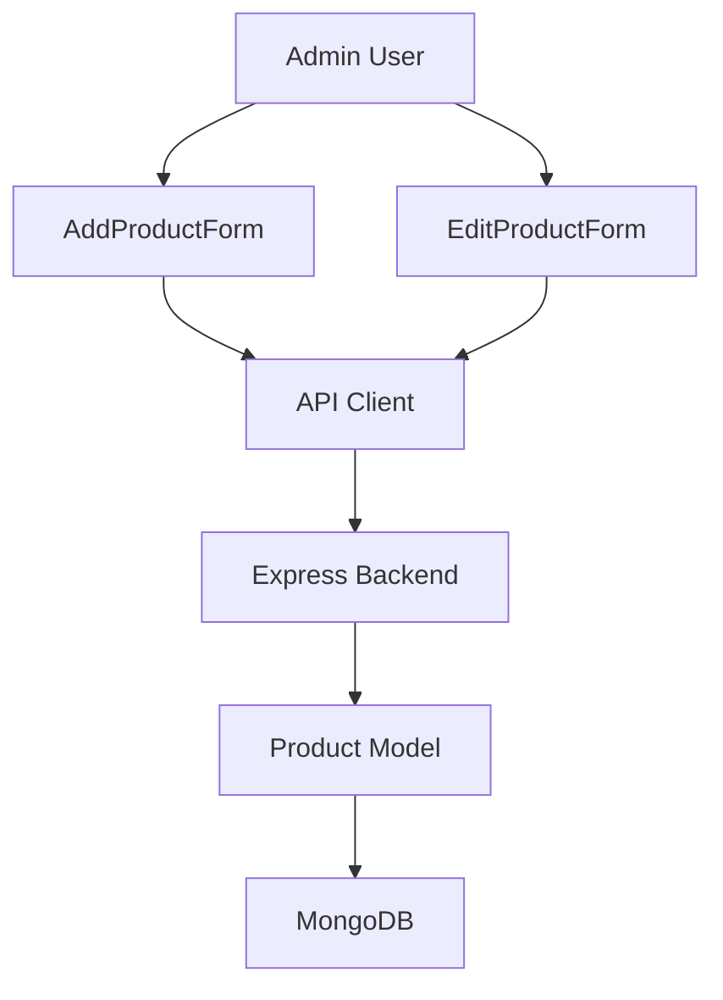

# Design Document: Product Specifications

## Overview

This feature extends the existing UrbanNook admin panel to support flexible product specifications stored as key-value pairs. The implementation involves:

1. Updating the MongoDB Product schema to include a specifications array
2. Modifying the backend API to handle specifications in create/update operations
3. Enhancing the AddProductForm component with dynamic specification fields
4. Enhancing the EditProductForm component with specification editing capabilities

The design maintains consistency with the existing codebase patterns, using the same styling (Tailwind CSS), state management approaches, and API communication patterns already established in the forms.

## Architecture

### System Components



### Data Flow

**Product Creation with Specifications:**
<<<<<<< HEAD
=======

>>>>>>> 9db8b8a188ae4e27fcb6cec188bb7b8d1ee340b7
1. Admin fills in product details and adds specifications via AddProductForm
2. Form validates and filters out empty specification entries
3. Form submits product data including specifications array to POST /admin/add/inventory
4. Backend validates the request and saves to MongoDB via Product model
5. Success response triggers form closure and product list refresh

**Product Update with Specifications:**
<<<<<<< HEAD
=======

>>>>>>> 9db8b8a188ae4e27fcb6cec188bb7b8d1ee340b7
1. Admin opens EditProductForm with existing product data
2. Form displays current specifications as editable fields
3. Admin modifies, adds, or removes specifications
4. Form detects changes and submits updated specifications to POST /admin/update/inventory/:productId
5. Backend updates the product document with new specifications array
6. Success response triggers form closure and product list refresh

## Components and Interfaces

### 1. Product Model (Backend)

**File:** `urbannook-admin/server/models/Product.js`

**Changes:**
<<<<<<< HEAD
=======

>>>>>>> 9db8b8a188ae4e27fcb6cec188bb7b8d1ee340b7
- Add `specifications` field to the product schema
- Type: Array of objects with `key` and `value` properties
- Default: Empty array
- Not required (products can exist without specifications)

**Schema Definition:**
<<<<<<< HEAD
=======

>>>>>>> 9db8b8a188ae4e27fcb6cec188bb7b8d1ee340b7
```javascript
specifications: [
  {
    key: { type: String, required: true },
<<<<<<< HEAD
    value: { type: String, required: true }
  }
]
=======
    value: { type: String, required: true },
  },
];
>>>>>>> 9db8b8a188ae4e27fcb6cec188bb7b8d1ee340b7
```

### 2. Backend API Endpoints

**Existing Endpoints to Modify:**

**POST /admin/add/inventory**
<<<<<<< HEAD
=======

>>>>>>> 9db8b8a188ae4e27fcb6cec188bb7b8d1ee340b7
- Accept optional `specifications` array in request body
- Validate that each specification has both key and value
- Store specifications with the product

**POST /admin/update/inventory/:productId**
<<<<<<< HEAD
=======

>>>>>>> 9db8b8a188ae4e27fcb6cec188bb7b8d1ee340b7
- Accept optional `specifications` array in request body
- Replace existing specifications with new array when provided
- If specifications not provided, leave existing specifications unchanged

**GET /admin/inventory** (likely already returns full product data)
<<<<<<< HEAD
=======

>>>>>>> 9db8b8a188ae4e27fcb6cec188bb7b8d1ee340b7
- Ensure specifications are included in product responses

### 3. AddProductForm Component

**File:** `urbannook-admin/client/src/components/AddProductForm.jsx`

**State Additions:**
<<<<<<< HEAD
```javascript
specifications: [{ key: "", value: "" }]  // Start with one empty row
=======

```javascript
specifications: [{ key: "", value: "" }]; // Start with one empty row
>>>>>>> 9db8b8a188ae4e27fcb6cec188bb7b8d1ee340b7
```

**New Functions:**

`handleSpecificationChange(index, field, value)`
<<<<<<< HEAD
=======

>>>>>>> 9db8b8a188ae4e27fcb6cec188bb7b8d1ee340b7
- Updates a specific specification's key or value
- Parameters: index (number), field ('key' | 'value'), value (string)

`addSpecificationField()`
<<<<<<< HEAD
=======

>>>>>>> 9db8b8a188ae4e27fcb6cec188bb7b8d1ee340b7
- Appends a new empty specification object to the array
- Called when "Add Specification" button is clicked

`removeSpecificationField(index)`
<<<<<<< HEAD
=======

>>>>>>> 9db8b8a188ae4e27fcb6cec188bb7b8d1ee340b7
- Removes specification at given index
- Prevents removal if only one empty specification remains

**Validation Updates:**

`validateProductForm(formData)`
<<<<<<< HEAD
- No changes needed - specifications are optional

`buildCreatePayload(formData)`
=======

- No changes needed - specifications are optional

`buildCreatePayload(formData)`

>>>>>>> 9db8b8a188ae4e27fcb6cec188bb7b8d1ee340b7
- Filter specifications to include only entries where both key and value are non-empty
- Trim whitespace from keys and values
- Only include specifications array in payload if at least one valid entry exists

**UI Structure:**
<<<<<<< HEAD
```
Product Specifications Section
├── Label: "Product Specifications"
├── Specification Rows (mapped from state)
│   ├── Key Input (text field)
│   ├── Value Input (text field)
│   └── Remove Button (X icon)
└── Add Specification Button (+ icon with text)
=======

```
Product Specifications Section
├  Label: "Product Specifications"
├  Specification Rows (mapped from state)
│   ├  Key Input (text field)
│   ├  Value Input (text field)
│   └  Remove Button (X icon)
└  Add Specification Button (+ icon with text)
>>>>>>> 9db8b8a188ae4e27fcb6cec188bb7b8d1ee340b7
```

### 4. EditProductForm Component

**File:** `urbannook-admin/client/src/components/EditProductForm.jsx`

**State Initialization:**
<<<<<<< HEAD
```javascript
specifications: product.specifications?.length 
  ? [...product.specifications]
  : [{ key: "", value: "" }]
=======

```javascript
specifications: product.specifications?.length
  ? [...product.specifications]
  : [{ key: "", value: "" }];
>>>>>>> 9db8b8a188ae4e27fcb6cec188bb7b8d1ee340b7
```

**New Functions:**

`handleSpecificationChange(index, field, value)`
<<<<<<< HEAD
=======

>>>>>>> 9db8b8a188ae4e27fcb6cec188bb7b8d1ee340b7
- Updates a specific specification's key or value
- Same implementation as AddProductForm

`addSpecificationField()`
<<<<<<< HEAD
=======

>>>>>>> 9db8b8a188ae4e27fcb6cec188bb7b8d1ee340b7
- Appends a new empty specification object
- Same implementation as AddProductForm

`removeSpecificationField(index)`
<<<<<<< HEAD
=======

>>>>>>> 9db8b8a188ae4e27fcb6cec188bb7b8d1ee340b7
- Removes specification at given index
- Allows removal of all specifications (can result in empty array)

**Change Detection:**

`getChangedFields(original, current)`
<<<<<<< HEAD
=======

>>>>>>> 9db8b8a188ae4e27fcb6cec188bb7b8d1ee340b7
- Add specifications comparison
- Compare arrays using JSON.stringify after filtering empty entries
- Include specifications in changed object if arrays differ

**UI Structure:**
<<<<<<< HEAD
=======

>>>>>>> 9db8b8a188ae4e27fcb6cec188bb7b8d1ee340b7
- Same as AddProductForm
- Pre-populated with existing specifications

## Data Models

### Product Document (MongoDB)

```javascript
{
  _id: ObjectId,
  productName: String,
  productId: String,
  uiProductId: String,
  productImg: String,
  secondaryImages: [String],
  productDes: String,
  sellingPrice: Number,
  productCategory: String,
  productQuantity: Number,
  dimensions: {
    length: Number,
    breadth: Number,
    height: Number
  },
  productStatus: String,
  tags: [String],
  isPublished: Boolean,
  productSubDes: String,
  productSubCategory: String,
  specifications: [              // NEW FIELD
    {
      key: String,
      value: String
    }
  ],
  createdAt: Date,
  updatedAt: Date
}
```

### Specification Object (Frontend State)

```typescript
interface Specification {
  key: string;
  value: string;
}
```

### Form Data Structure

```javascript
{
  // ... existing fields ...
  specifications: [
    { key: "Finish Type", value: "Raw 3D Printed Finish" },
    { key: "Base Material", value: "3D Printed PLA / PLA+" },
<<<<<<< HEAD
    { key: "Bulb Base", value: "E27 (LED Recommended)" }
  ]
=======
    { key: "Bulb Base", value: "E27 (LED Recommended)" },
  ];
>>>>>>> 9db8b8a188ae4e27fcb6cec188bb7b8d1ee340b7
}
```

## Correctness Properties

<<<<<<< HEAD
*A property is a characteristic or behavior that should hold true across all valid executions of a system—essentially, a formal statement about what the system should do. Properties serve as the bridge between human-readable specifications and machine-verifiable correctness guarantees.*


### Property 1: Specification Persistence Round Trip

*For any* product with a non-empty specifications array, saving the product to the database and then retrieving it should return all specifications with identical keys and values.
=======
_A property is a characteristic or behavior that should hold true across all valid executions of a system—essentially, a formal statement about what the system should do. Properties serve as the bridge between human-readable specifications and machine-verifiable correctness guarantees._

### Property 1: Specification Persistence Round Trip

_For any_ product with a non-empty specifications array, saving the product to the database and then retrieving it should return all specifications with identical keys and values.
>>>>>>> 9db8b8a188ae4e27fcb6cec188bb7b8d1ee340b7

**Validates: Requirements 1.2, 10.1, 10.3**

### Property 2: Specification Order Preservation

<<<<<<< HEAD
*For any* product with multiple specifications, the order of specifications after saving and retrieving should match the original order.
=======
_For any_ product with multiple specifications, the order of specifications after saving and retrieving should match the original order.
>>>>>>> 9db8b8a188ae4e27fcb6cec188bb7b8d1ee340b7

**Validates: Requirements 1.4, 8.1, 8.4**

### Property 3: Add Specification Increases Count

<<<<<<< HEAD
*For any* form state with N specifications, clicking the "Add Specification" button should result in N+1 specifications in the form state.
=======
_For any_ form state with N specifications, clicking the "Add Specification" button should result in N+1 specifications in the form state.
>>>>>>> 9db8b8a188ae4e27fcb6cec188bb7b8d1ee340b7

**Validates: Requirements 2.2, 2.4, 5.3**

### Property 4: Remove Specification Decreases Count

<<<<<<< HEAD
*For any* form state with N specifications (where N > 1), clicking the "Remove" button on any specification should result in N-1 specifications in the form state.
=======
_For any_ form state with N specifications (where N > 1), clicking the "Remove" button on any specification should result in N-1 specifications in the form state.
>>>>>>> 9db8b8a188ae4e27fcb6cec188bb7b8d1ee340b7

**Validates: Requirements 3.2, 6.2**

### Property 5: Remove Preserves Order

<<<<<<< HEAD
*For any* form state with multiple specifications, removing a specification at index i should maintain the relative order of all other specifications.
=======
_For any_ form state with multiple specifications, removing a specification at index i should maintain the relative order of all other specifications.
>>>>>>> 9db8b8a188ae4e27fcb6cec188bb7b8d1ee340b7

**Validates: Requirements 3.4, 8.3**

### Property 6: Incomplete Specifications Filtered

<<<<<<< HEAD
*For any* form submission, specifications where either the key is empty or the value is empty (after trimming whitespace) should be excluded from the request payload.
=======
_For any_ form submission, specifications where either the key is empty or the value is empty (after trimming whitespace) should be excluded from the request payload.
>>>>>>> 9db8b8a188ae4e27fcb6cec188bb7b8d1ee340b7

**Validates: Requirements 4.1, 4.2, 4.4, 2.5**

### Property 7: Whitespace Trimming

<<<<<<< HEAD
*For any* specification with leading or trailing whitespace in the key or value, the saved specification should have the whitespace trimmed.
=======
_For any_ specification with leading or trailing whitespace in the key or value, the saved specification should have the whitespace trimmed.
>>>>>>> 9db8b8a188ae4e27fcb6cec188bb7b8d1ee340b7

**Validates: Requirements 4.4**

### Property 8: Duplicate Keys Allowed

<<<<<<< HEAD
*For any* product with specifications containing duplicate keys, all specifications should be stored and retrieved as separate entries.
=======
_For any_ product with specifications containing duplicate keys, all specifications should be stored and retrieved as separate entries.
>>>>>>> 9db8b8a188ae4e27fcb6cec188bb7b8d1ee340b7

**Validates: Requirements 4.5**

### Property 9: Edit Form Displays All Specifications

<<<<<<< HEAD
*For any* product with N specifications, opening the edit form should display exactly N editable specification rows with matching keys and values.
=======
_For any_ product with N specifications, opening the edit form should display exactly N editable specification rows with matching keys and values.
>>>>>>> 9db8b8a188ae4e27fcb6cec188bb7b8d1ee340b7

**Validates: Requirements 5.1**

### Property 10: Specification Modification Updates State

<<<<<<< HEAD
*For any* specification in the edit form, changing its key or value should update that specific specification in the form state without affecting other specifications.
=======
_For any_ specification in the edit form, changing its key or value should update that specific specification in the form state without affecting other specifications.
>>>>>>> 9db8b8a188ae4e27fcb6cec188bb7b8d1ee340b7

**Validates: Requirements 5.4**

### Property 11: Modified Specifications Included in Update

<<<<<<< HEAD
*For any* product update where specifications have been modified, the update request payload should include the complete updated specifications array.
=======
_For any_ product update where specifications have been modified, the update request payload should include the complete updated specifications array.
>>>>>>> 9db8b8a188ae4e27fcb6cec188bb7b8d1ee340b7

**Validates: Requirements 5.5, 6.3**

### Property 12: New Specifications Appended

<<<<<<< HEAD
*For any* form state with existing specifications, adding a new specification should append it to the end of the specifications array.
=======
_For any_ form state with existing specifications, adding a new specification should append it to the end of the specifications array.
>>>>>>> 9db8b8a188ae4e27fcb6cec188bb7b8d1ee340b7

**Validates: Requirements 8.2**

### Property 13: Backend Update Replaces Specifications

<<<<<<< HEAD
*For any* product with existing specifications, sending an update request with a new specifications array should completely replace the old specifications with the new ones.
=======
_For any_ product with existing specifications, sending an update request with a new specifications array should completely replace the old specifications with the new ones.
>>>>>>> 9db8b8a188ae4e27fcb6cec188bb7b8d1ee340b7

**Validates: Requirements 10.2**

### Property 14: Backend Preserves Specifications When Not Provided

<<<<<<< HEAD
*For any* product with existing specifications, sending an update request without a specifications field should leave the existing specifications unchanged.
=======
_For any_ product with existing specifications, sending an update request without a specifications field should leave the existing specifications unchanged.
>>>>>>> 9db8b8a188ae4e27fcb6cec188bb7b8d1ee340b7

**Validates: Requirements 10.5**

### Property 15: Each Specification Row Has Remove Button

<<<<<<< HEAD
*For any* form state with N specifications, the rendered form should contain exactly N remove buttons, one for each specification row.
=======
_For any_ form state with N specifications, the rendered form should contain exactly N remove buttons, one for each specification row.
>>>>>>> 9db8b8a188ae4e27fcb6cec188bb7b8d1ee340b7

**Validates: Requirements 3.1, 6.1**

## Error Handling

### Frontend Validation

**Empty Specifications:**
<<<<<<< HEAD
=======

>>>>>>> 9db8b8a188ae4e27fcb6cec188bb7b8d1ee340b7
- Forms should filter out empty specifications before submission
- At least one empty specification row should always be available for input
- No error messages needed for empty specifications (they're simply excluded)

**Whitespace Handling:**
<<<<<<< HEAD
=======

>>>>>>> 9db8b8a188ae4e27fcb6cec188bb7b8d1ee340b7
- Trim whitespace from keys and values before validation
- Treat whitespace-only strings as empty

**Form State Errors:**
<<<<<<< HEAD
=======

>>>>>>> 9db8b8a188ae4e27fcb6cec188bb7b8d1ee340b7
- If API request fails, maintain form state so user doesn't lose data
- Display error toast with message from backend or generic error message

### Backend Validation

**Invalid Specification Format:**
<<<<<<< HEAD
=======

>>>>>>> 9db8b8a188ae4e27fcb6cec188bb7b8d1ee340b7
- Return 400 Bad Request if specifications is not an array
- Return 400 Bad Request if any specification is missing key or value properties
- Error message: "Invalid specifications format"

**Database Errors:**
<<<<<<< HEAD
=======

>>>>>>> 9db8b8a188ae4e27fcb6cec188bb7b8d1ee340b7
- Return 500 Internal Server Error if database operation fails
- Log error details for debugging
- Error message: "Failed to save product specifications"

**Missing Product:**
<<<<<<< HEAD
=======

>>>>>>> 9db8b8a188ae4e27fcb6cec188bb7b8d1ee340b7
- Return 404 Not Found if product doesn't exist during update
- Error message: "Product not found"

## Testing Strategy

This feature requires both unit tests and property-based tests to ensure comprehensive coverage.

### Unit Tests

Unit tests should focus on specific examples and edge cases:

**Frontend (React Components):**
<<<<<<< HEAD
=======

>>>>>>> 9db8b8a188ae4e27fcb6cec188bb7b8d1ee340b7
- Initial render with empty specifications
- Initial render with existing specifications
- Add specification button creates empty row
- Remove specification button removes correct row
- Cannot remove last empty specification in AddProductForm
- Can remove all specifications in EditProductForm
- Specification input changes update state correctly
- Form submission includes only non-empty specifications

**Backend (API Endpoints):**
<<<<<<< HEAD
=======

>>>>>>> 9db8b8a188ae4e27fcb6cec188bb7b8d1ee340b7
- Create product with valid specifications
- Create product without specifications
- Update product with new specifications
- Update product without specifications field (preserves existing)
- Retrieve product includes specifications in response
- Invalid specification format returns 400 error

### Property-Based Tests

Property tests should verify universal properties across all inputs. Each test should run a minimum of 100 iterations.

**Test Configuration:**
<<<<<<< HEAD
=======

>>>>>>> 9db8b8a188ae4e27fcb6cec188bb7b8d1ee340b7
- Use a property-based testing library appropriate for the language (e.g., fast-check for JavaScript/TypeScript)
- Minimum 100 iterations per property test
- Each test must reference its design document property using the tag format below

**Tag Format:**
<<<<<<< HEAD
=======

>>>>>>> 9db8b8a188ae4e27fcb6cec188bb7b8d1ee340b7
```javascript
// Feature: product-specifications, Property 1: Specification Persistence Round Trip
```

**Property Test Coverage:**

1. **Specification Persistence Round Trip** (Property 1)
   - Generate random products with random specifications
   - Save to database and retrieve
   - Verify all specifications match

2. **Specification Order Preservation** (Property 2)
   - Generate random specifications in specific order
   - Save and retrieve
   - Verify order matches

3. **Add Specification Increases Count** (Property 3)
   - Generate random initial specification count
   - Simulate add action
   - Verify count increases by 1

4. **Remove Specification Decreases Count** (Property 4)
   - Generate random specifications (N > 1)
   - Simulate remove action
   - Verify count decreases by 1

5. **Remove Preserves Order** (Property 5)
   - Generate random specifications
   - Remove random index
   - Verify remaining order preserved

6. **Incomplete Specifications Filtered** (Property 6)
   - Generate mix of complete and incomplete specifications
   - Build payload
   - Verify only complete specifications included

7. **Whitespace Trimming** (Property 7)
   - Generate specifications with random whitespace
   - Process through validation
   - Verify whitespace trimmed

8. **Duplicate Keys Allowed** (Property 8)
   - Generate specifications with duplicate keys
   - Save and retrieve
   - Verify all duplicates preserved

9. **Edit Form Displays All Specifications** (Property 9)
   - Generate random product with specifications
   - Initialize edit form
   - Verify all specifications displayed

10. **Specification Modification Updates State** (Property 10)
    - Generate random specifications
    - Modify random specification
    - Verify only that specification changed

11. **Modified Specifications Included in Update** (Property 11)
    - Generate original and modified specifications
    - Build update payload
    - Verify modified specifications included

12. **New Specifications Appended** (Property 12)
    - Generate existing specifications
    - Add new specification
    - Verify new one at end

13. **Backend Update Replaces Specifications** (Property 13)
    - Generate original and new specifications
    - Send update request
    - Verify old specifications replaced

14. **Backend Preserves Specifications When Not Provided** (Property 14)
    - Generate product with specifications
    - Send update without specifications field
    - Verify specifications unchanged

15. **Each Specification Row Has Remove Button** (Property 15)
    - Generate random number of specifications
    - Render form
    - Verify remove button count matches specification count

### Integration Tests

Integration tests should verify the complete flow:

- Create product with specifications via API, verify in database
- Update product specifications via API, verify changes persisted
- Edit form loads existing specifications correctly
- Add form submits specifications correctly
- Remove all specifications from product via edit form

### Manual Testing Checklist

- Visual layout of specification fields matches design
- Add/remove buttons are clearly visible and accessible
- Form remains usable after adding/removing many specifications
- Error messages display correctly on API failures
- Form state preserved on submission errors
