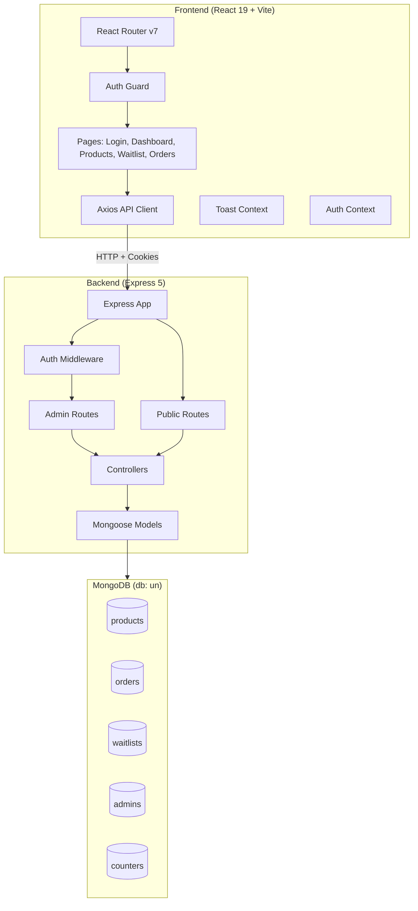
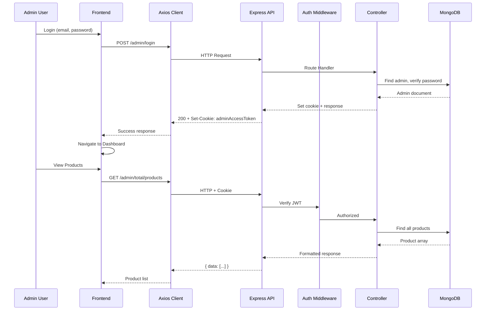

# Design Document: UrbanNook Admin Panel

## Overview

The UrbanNook Admin Panel is a full-stack application with two main parts:

1. **Backend**: An Express 5 REST API server connected to MongoDB via Mongoose, providing authentication, product CRUD, waitlist, and orders endpoints. Express 5's automatic async error forwarding eliminates manual try/catch blocks.

2. **Frontend**: A React 19 + Vite single-page application using Tailwind CSS for styling, React Router DOM v7 for routing, Axios for API communication, and react-cookie for auth token management.

The project is organized as a monorepo with `server/` and `client/` directories inside `urbannook-admin/`.

## Architecture



### Request Flow



## Components and Interfaces

### Backend Components

#### 1. Server Entry Point (`server/index.js`)

Initializes Express 5 app, connects to MongoDB, configures middleware (CORS, cookie-parser, JSON body parser), mounts routes, and starts the server.

```javascript
// Key configuration
const app = express();
app.use(cors({ origin: process.env.CORS_ORIGIN, credentials: true }));
app.use(cookieParser());
app.use(express.json());

// Route mounting
app.use("/api/v1/admin", adminRoutes);
app.use("/api/v1", publicRoutes);

// Global error handler
app.use(errorHandler);
```

#### 2. Database Connection (`server/config/db.js`)

```javascript
// Connects to MongoDB using MONGODB_URI env var, database name "un"
const connectDB = async () => {
  const conn = await mongoose.connect(process.env.MONGODB_URI, { dbName: "un" });
  console.log(`MongoDB connected: ${conn.connection.host}`);
};
```

#### 3. Auth Middleware (`server/middleware/auth.js`)

Extracts JWT from `adminAccessToken` cookie or `Authorization: Bearer <token>` header. Verifies with `jsonwebtoken`. Attaches decoded payload to `req.admin`. Returns 401 if missing/invalid.

```javascript
const verifyAuth = async (req, res, next) => {
  const token = req.cookies?.adminAccessToken || 
    req.header("Authorization")?.replace("Bearer ", "");
  if (!token) return res.status(401).json({ statusCode: 401, message: "Authentication token missing", data: null, success: false });
  const decoded = jwt.verify(token, process.env.JWT_SECRET);
  req.admin = decoded;
  next();
};
```

#### 4. Response Helper (`server/utils/apiResponse.js`)

Utility functions to ensure consistent response format across all endpoints.

```javascript
class ApiResponse {
  constructor(statusCode, message, data = null) {
    this.statusCode = statusCode;
    this.message = message;
    this.data = data;
    this.success = statusCode >= 200 && statusCode < 300;
  }
}
```

#### 5. Controllers

| Controller | File | Endpoints |
|---|---|---|
| Auth Controller | `server/controllers/auth.js` | POST /admin/login, POST /admin/logout |
| Product Controller | `server/controllers/product.js` | GET /admin/total/products, POST /admin/add/inventory, POST /admin/update/inventory/:productId, GET /products, GET /product/:productId, GET /products/homepage |
| Waitlist Controller | `server/controllers/waitlist.js` | GET /admin/joined/waitlist |
| Order Controller | `server/controllers/order.js` | GET /admin/orders |

#### 6. Auto-increment Counter for uiProductId

A `Counter` model in MongoDB tracks the last used number for `uiProductId`. When creating a product, the controller atomically increments this counter and formats it as `UN-PROD-{number}`.

```javascript
// Counter Model
const counterSchema = new mongoose.Schema({
  _id: String,        // e.g., "uiProductId"
  sequence_value: Number
});

// Usage in product creation
const counter = await Counter.findByIdAndUpdate(
  "uiProductId",
  { $inc: { sequence_value: 1 } },
  { new: true, upsert: true }
);
const uiProductId = `UN-PROD-${counter.sequence_value}`;
```

### Frontend Components

#### 1. API Client (`client/src/api/axios.js`)

Configured Axios instance with base URL from `VITE_API_BASE_URL`, `withCredentials: true`, and a response interceptor that redirects to `/admin/login` on 401 responses.

```javascript
const apiClient = axios.create({
  baseURL: import.meta.env.VITE_API_BASE_URL,
  withCredentials: true,
});

// Request interceptor: attach Bearer token from cookie
apiClient.interceptors.request.use((config) => {
  const cookies = new Cookies();
  const token = cookies.get("adminAccessToken");
  if (token) config.headers.Authorization = `Bearer ${token}`;
  return config;
});

// Response interceptor: handle 401
apiClient.interceptors.response.use(
  (response) => response,
  (error) => {
    if (error.response?.status === 401) {
      const cookies = new Cookies();
      cookies.remove("adminAccessToken", { path: "/" });
      window.location.href = "/admin/login";
    }
    return Promise.reject(error);
  }
);
```

#### 2. Auth Context (`client/src/context/AuthContext.jsx`)

React context providing `user`, `login()`, `logout()`, and `isAuthenticated` state. Uses `react-cookie` to read/write the `adminAccessToken` cookie.

#### 3. Toast Context (`client/src/context/ToastContext.jsx`)

React context providing `showToast(message, type)` function. Renders toast notifications with auto-dismiss (default 4 seconds) and manual close. Types: `success`, `error`, `info`.

#### 4. Auth Guard (`client/src/components/AuthGuard.jsx`)

Route wrapper component. Checks for `adminAccessToken` cookie. If absent, redirects to `/admin/login`. If present and on login page, redirects to `/admin/dashboard`.

#### 5. Layout Component (`client/src/components/Layout.jsx`)

Wraps authenticated pages. Desktop: fixed sidebar (240px) + scrollable main content. Mobile (< 768px): top header with hamburger → slide-out drawer. Sidebar contains nav links with Lucide icons and active route highlighting.

#### 6. Page Components

| Page | Route | Component File |
|---|---|---|
| Login | `/admin/login` | `client/src/pages/Login.jsx` |
| Dashboard | `/admin/dashboard` | `client/src/pages/Dashboard.jsx` |
| Products | `/admin/products` | `client/src/pages/Products.jsx` |
| Waitlist | `/admin/waitlist` | `client/src/pages/Waitlist.jsx` |
| Orders | `/admin/orders` | `client/src/pages/Orders.jsx` |

#### 7. Routing Structure (`client/src/App.jsx`)

```javascript
<Routes>
  <Route path="/admin/login" element={<Login />} />
  <Route element={<AuthGuard><Layout /></AuthGuard>}>
    <Route path="/admin/dashboard" element={<Dashboard />} />
    <Route path="/admin/products" element={<Products />} />
    <Route path="/admin/waitlist" element={<Waitlist />} />
    <Route path="/admin/orders" element={<Orders />} />
  </Route>
  <Route path="*" element={<Navigate to="/admin/dashboard" />} />
</Routes>
```

## Data Models

### Backend Mongoose Schemas

#### Product Schema

```javascript
{
  productName:        { type: String, required: true, unique: true },
  productId:          { type: String, required: true, unique: true },  // UUID v7
  uiProductId:        { type: String, required: true, unique: true },  // UN-PROD-{n}
  productImg:         { type: String, required: true, unique: true },
  productDes:         { type: String, required: true },
  sellingPrice:       { type: Number, required: true, min: 10 },
  productCategory:    { type: String, required: true },
  productQuantity:    { type: Number, default: 0 },
  productStatus:      { type: String, enum: ["in_stock", "out_of_stock", "discontinued"] },
  tags:               [{ type: String, enum: ["featured", "new_arrival", "best_seller", "trending"] }],
  isPublished:        { type: Boolean, default: false },
  productSubDes:      { type: String },
  productSubCategory: { type: String }
}
// timestamps: true
```

#### Order Schema

```javascript
{
  userId:    String,
  orderId:   { type: String, unique: true },
  items: [{
    productId: String,
    productSnapshot: {
      productName: String,
      productImg: String,
      quantity: Number,
      productCategory: String,
      productSubCategory: String,
      priceAtPurchase: Number
    }
  }],
  amount: Number,
  deliveryAddress: {
    addressId: String,
    formattedAddress: String,
    lat: Number,
    long: Number
  },
  payment: {
    razorpayOrderId: String,
    razorpayPaymentId: String,
    razorpaySignature: String
  },
  status: { type: String, enum: ["CREATED", "PAID", "FAILED"] }
}
// timestamps: true
```

#### Waitlist Schema

```javascript
{
  userName:  { type: String, required: true },
  userEmail: { type: String, required: true, unique: true },
  joinedAt:  { type: Date, default: Date.now }
}
// timestamps: true
```

#### Admin Schema

```javascript
{
  email:    { type: String, required: true, unique: true },
  password: { type: String, required: true }  // bcrypt hashed
}
// timestamps: true
```

#### Counter Schema (for auto-increment)

```javascript
{
  _id:            String,  // "uiProductId"
  sequence_value: Number
}
```

### Frontend Data Types (for reference)

```typescript
// Product type used in frontend state
interface Product {
  _id: string;
  productName: string;
  productId: string;
  uiProductId: string;
  productImg: string;
  productDes: string;
  sellingPrice: number;
  productCategory: string;
  productQuantity: number;
  productStatus: "in_stock" | "out_of_stock" | "discontinued";
  tags: ("featured" | "new_arrival" | "best_seller" | "trending")[];
  isPublished: boolean;
  productSubDes?: string;
  productSubCategory?: string;
  createdAt: string;
  updatedAt: string;
}

// Order type
interface Order {
  _id: string;
  userId: string;
  orderId: string;
  items: {
    productId: string;
    productSnapshot: {
      productName: string;
      productImg: string;
      quantity: number;
      productCategory: string;
      productSubCategory?: string;
      priceAtPurchase: number;
    };
  }[];
  amount: number;
  deliveryAddress: {
    addressId: string;
    formattedAddress: string;
    lat: number;
    long: number;
  };
  payment: {
    razorpayOrderId: string;
    razorpayPaymentId: string;
    razorpaySignature: string;
  };
  status: "CREATED" | "PAID" | "FAILED";
  createdAt: string;
  updatedAt: string;
}

// WaitlistUser type
interface WaitlistUser {
  _id: string;
  userName: string;
  userEmail: string;
  joinedAt: string;
  createdAt: string;
  updatedAt: string;
}

// API Response wrapper
interface ApiResponse<T> {
  statusCode: number;
  message: string;
  data: T;
  success: boolean;
}
```


## Correctness Properties

*A property is a characteristic or behavior that should hold true across all valid executions of a system — essentially, a formal statement about what the system should do. Properties serve as the bridge between human-readable specifications and machine-verifiable correctness guarantees.*

### Property 1: Mongoose Model Validation

*For any* input object and any Mongoose model (Product, Order, Waitlist, Admin), the model should accept objects that satisfy all required fields and constraints (e.g., sellingPrice >= 10, valid enum values) and reject objects that violate any constraint, returning a Mongoose validation error.

**Validates: Requirements 1.3, 1.4, 1.5, 1.6**

### Property 2: Auth Middleware Token Verification

*For any* HTTP request to a protected endpoint, the Auth_Middleware should allow the request if and only if a valid JWT token is present in either the `adminAccessToken` cookie or the `Authorization: Bearer` header. Requests without a valid token should receive a 401 response with message "Authentication token missing".

**Validates: Requirements 2.4, 2.5**

### Property 3: Product List Sorting

*For any* set of products in the database, the GET /admin/total/products endpoint should return all products, and for every consecutive pair of products in the response array, the first product's createdAt should be greater than or equal to the second product's createdAt.

**Validates: Requirements 3.1**

### Property 4: Product ID Auto-Generation

*For any* valid product creation request, the created product should have a productId matching UUID v7 format and a uiProductId matching the pattern `UN-PROD-{number}` where the number is sequentially incremented. The product should be retrievable from the database after creation.

**Validates: Requirements 3.2**

### Property 5: Partial Update Preservation

*For any* product and any subset of fields to update, after a POST to /admin/update/inventory/:productId, only the specified fields should change while all other fields remain identical to their pre-update values.

**Validates: Requirements 3.3**

### Property 6: Quantity Increment/Decrement Round Trip

*For any* product with quantity Q and any positive integer D, incrementing by D (action: "add") then decrementing by D (action: "sub") should result in the original quantity Q.

**Validates: Requirements 3.4, 3.5**

### Property 7: Pagination Consistency

*For any* set of products and any valid combination of pagination parameters (limit, currentPage), the response should satisfy: totalPages equals ceil(totalProducts / limit), the number of returned products should be at most limit, and currentPage should match the requested page.

**Validates: Requirements 3.6**

### Property 8: Single Product Retrieval

*For any* product stored in the database, a GET request to /product/:productId should return that exact product with all fields matching the stored document.

**Validates: Requirements 3.7**

### Property 9: Homepage Tag Grouping

*For any* set of tagged products in the database, the GET /products/homepage endpoint should return products grouped by their tags (featured, new_arrival, best_seller, trending), with each group containing at most 2 products, and every product in a group should have the corresponding tag.

**Validates: Requirements 3.8**

### Property 10: Waitlist Count Consistency

*For any* set of waitlist users in the database, the GET /admin/joined/waitlist endpoint should return an array whose length equals the totalJoinedUserWaitList count value.

**Validates: Requirements 4.1**

### Property 11: Orders Sorting

*For any* set of orders in the database, the GET /admin/orders endpoint should return all orders, and for every consecutive pair in the response array, the first order's createdAt should be greater than or equal to the second order's createdAt.

**Validates: Requirements 5.1**

### Property 12: API Response Format Consistency

*For any* API endpoint response, the response body should contain exactly the fields: statusCode (number), message (string), data (object or null), and success (boolean). For responses with statusCode in 200-299, success should be true. For all other status codes, success should be false and data should be null.

**Validates: Requirements 6.1, 6.2**

### Property 13: Auth Guard Route Protection

*For any* protected route in the frontend, when the adminAccessToken cookie is absent, the Auth_Guard should redirect to /admin/login. When the cookie is present and the user navigates to /admin/login, the Auth_Guard should redirect to /admin/dashboard.

**Validates: Requirements 8.1, 8.3**

### Property 14: API Client 401 Interceptor

*For any* API response with status 401, the Axios response interceptor should remove the adminAccessToken cookie and trigger navigation to /admin/login.

**Validates: Requirements 8.2**

### Property 15: Product Status Badge Color Mapping

*For any* product status value, the status badge should render with the correct color: green for "in_stock", yellow for "out_of_stock", and red for "discontinued".

**Validates: Requirements 11.3**

### Property 16: Product Form Validation

*For any* product form submission, the form should reject submission if any of the required fields (productName, productImg, productDes, sellingPrice, productCategory, productStatus) are empty, or if sellingPrice is less than 10. The form should accept submission when all required fields are provided and sellingPrice >= 10.

**Validates: Requirements 12.3, 12.4**

### Property 17: Product Create Payload Exclusion

*For any* product creation request sent from the frontend, the request body should never contain productId or uiProductId fields.

**Validates: Requirements 12.2**

### Property 18: Edit Form Changed Fields Only

*For any* product edit submission where a subset of fields have been modified, the request body sent to the API should contain only the modified fields and should not include unchanged fields.

**Validates: Requirements 13.1**

### Property 19: Edit Form Pre-population

*For any* product, when the edit form is opened, every form field should be pre-populated with the corresponding value from the product data.

**Validates: Requirements 13.4**

### Property 20: Order Status Badge Color Mapping

*For any* order status value, the status badge should render with the correct color: green for "PAID", yellow for "CREATED", and red for "FAILED".

**Validates: Requirements 15.3**

### Property 21: Sidebar Active Route Highlighting

*For any* route in the application, the corresponding Sidebar navigation link should be visually highlighted as active while all other links should not be highlighted.

**Validates: Requirements 16.3**

### Property 22: Toast Notification Display

*For any* operation result (success or error), the Toast system should display a notification with the correct type (success/error) and the message from the operation result.

**Validates: Requirements 17.1, 17.2**

## Error Handling

### Backend Error Handling

1. **Global Error Handler Middleware**: Express 5 automatically forwards rejected promises to error middleware. A global error handler catches all unhandled errors and returns them in the standard API response format with appropriate status codes.

2. **Mongoose Validation Errors**: Caught by the global error handler, transformed into 400 responses with descriptive messages about which fields failed validation.

3. **JWT Errors**: Token expiration and invalid token errors are caught by the auth middleware and returned as 401 responses.

4. **Duplicate Key Errors**: MongoDB duplicate key errors (e.g., duplicate productName) are caught and returned as 409 Conflict responses.

5. **Not Found Errors**: When a product or resource is not found, controllers return 404 responses.

### Frontend Error Handling

1. **Axios Response Interceptor**: Catches all 401 responses globally, clears auth state, and redirects to login.

2. **Per-Request Error Handling**: Each API call in page components catches errors and displays them via Toast notifications using the error message from the API response.

3. **Loading States**: All data-fetching pages show loading indicators during fetch and error states with retry buttons on failure.

4. **Form Validation**: Client-side validation prevents invalid submissions. Server-side validation errors are displayed via Toast notifications.

## Testing Strategy

### Testing Framework

- **Backend**: Jest for unit tests, Supertest for HTTP endpoint tests
- **Frontend**: Vitest + React Testing Library for component tests
- **Property-Based Testing**: fast-check library for both backend and frontend property tests

### Unit Tests

Unit tests cover specific examples and edge cases:
- Auth middleware with valid/invalid/expired/missing tokens
- Product creation with valid and invalid data
- Quantity increment/decrement edge cases (zero, negative)
- Login form submission with valid/invalid credentials
- Toast notification display and auto-dismiss
- Status badge color mapping for all enum values

### Property-Based Tests

Each correctness property from the design document is implemented as a property-based test using fast-check with a minimum of 100 iterations per test.

Each test is tagged with a comment in the format:
**Feature: urbannook-admin-panel, Property {number}: {property_text}**

Property tests focus on:
- Model validation across random valid/invalid inputs (Property 1)
- Auth middleware with random token scenarios (Property 2)
- Product sorting invariants (Property 3)
- ID generation format compliance (Property 4)
- Partial update field preservation (Property 5)
- Quantity round-trip consistency (Property 6)
- Pagination math correctness (Property 7)
- Response format consistency (Property 12)
- Form validation across random field combinations (Property 16)
- Status badge color mapping (Properties 15, 20)

### Test Organization

- Backend tests: `server/__tests__/` directory
- Frontend tests: `client/src/__tests__/` directory
- Property tests are co-located with their related unit tests
- Each property test file references the design document property number
